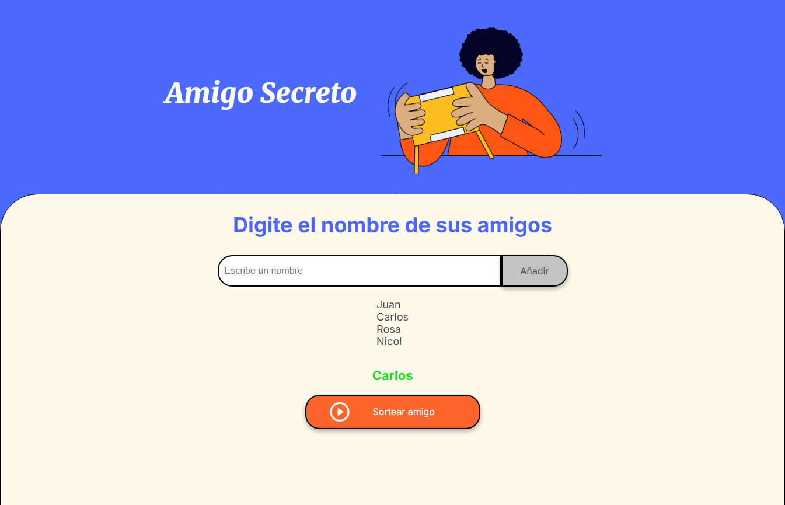

<h1 align="center">DESAFIO DE AMIGOS SECRETOS</h1>


<h2 align="center"> ¿Qué es un desafío de amigos secretos? </h2>
<p>
Un desafío de amigos secretos es un juego en el que insertas un listado de amigos y le das a sortear para seleccionar un amigo de la lista.
</p>


## Índice

* [Título e imagen de portada](#desafio-de-amigos-secretos)
* [Índice](#índice)
* [Descripción del proyecto](#descripción-del-proyecto)
* [Características de la aplicación y demostración]( #Características-de-la-aplicación-y-demostración)
* [Acceso al proyecto](#acceso-proyecto)
* [Tecnologías utilizadas](#tecnologías-utilizadas)
* [Personas-Desarrolladores del Proyecto](#personas-desarrolladores)
* [Licencia](#licencia)
* [Conclusión](#conclusión)

## Descripción del proyecto

El Desafío de Amigos Secretos es una divertida herramienta que permite a los usuarios insertar una lista de amigos y sortear aleatoriamente un amigo de la lista. Perfecto para reuniones y eventos festivos.

## Características de la aplicación y demostración

### 🔨 Funcionalidades:
- `Funcionalidad 1`: Insertar lista de amigos: Permite agregar nombres a una lista.
- `Funcionalidad 2`: Sortear amigo: Selecciona aleatoriamente un amigo de la lista.

### Demostración:


## Acceso proyecto

Puedes acceder al proyecto desde el siguiente enlace: [Desafío de Amigos Secretos](https://github.com/dalvinxo/challenge_amigo_secreto)

Para clonar el repositorio, usa el siguiente comando:
```sh
git clone https://github.com/dalvinxo/challenge_amigo_secreto.git
```
## Tecnologías utilizadas

- HTML5
- CSS3
- JavaScript

## Personas Desarrolladoras del Proyecto

[<br><sub>Dalvin Molina</sub>](https://github.com/dalvinxo)

## Licencia

Este proyecto está bajo la Licencia MIT. Consulta el archivo [LICENSE](LICENSE) para más información.

## Conclusión

Gracias por visitar el proyecto Desafío de Amigos Secretos de Alura LATAM y la comunidad. ¡Esperamos que disfrutes usándolo tanto como disfrute creándolo!
